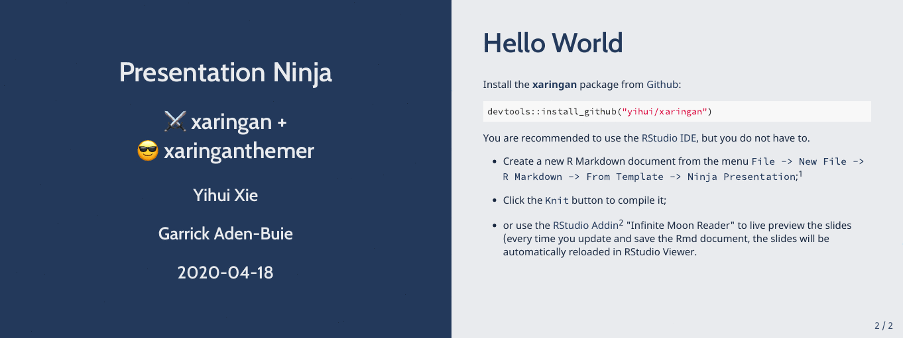
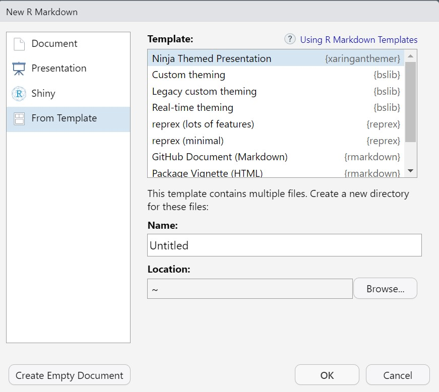
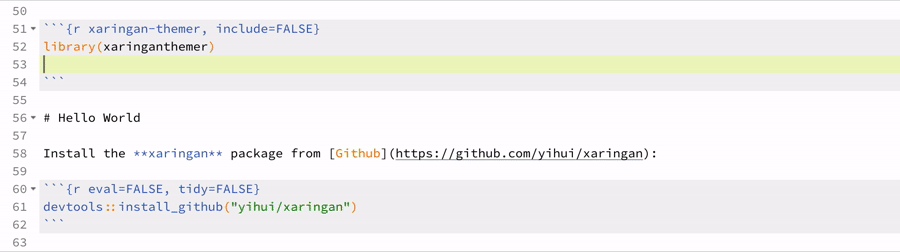

```{r setup, include=FALSE}
options(htmltools.dir.version = FALSE)
if (!require("knitr")) {
   install.packages("knitr")
   library(knitr)
}
if (!require("pander")) {
   install.packages("pander")
   library(pander)
}
if (!require("plotly")) {
   install.packages("plotly")
   library(plotly)
}
if (!require("ggplot2")) {
   install.packages("ggplot2")
   library(ggplot2)
}
knitr::opts_chunk$set(
                  fig.width=3, 
                  fig.height=3, 
                  fig.retina=12,
                  out.width = "100%",
                  cache = FALSE,
                  echo = TRUE,
                  message = FALSE, 
                  warning = FALSE,
                  hiline = TRUE
                  )
```


```{r xaringan-themer, include=FALSE, warning=FALSE}
library(xaringanthemer)
  style_duo_accent(primary_color = "#1F4257",
          secondary_color = "#380F2A",
          # fonts
          header_font_google = google_font("Martel"),
          text_font_google = google_font("Lato"),
          code_font_google = google_font("Fira Mono"))
```

class:inverse4, top

<h1 align="center"> Table of Contents</h1>
<BR>

.pull-left[
- What is **xaringan** presentation?
   - Demos of **xaringanthemer** presentation
   - Installation and configurations
   - CSS and modifications
- Basic syntax and formatting
   - Markup languages
   - Highlighting and formatting
   - List types
- Coloring and color matching
   - Text coloring
   - Slide background coloring
   - RGB and HEX color mixing 
- Matching R plot and slide background
   - Customizing background color
   - choosing appropriate colors for plots
]

.pull-right[
- Aesthetics of plots and tables
   - Managing graphical features
      - Sizes of title
      - sizes of labels and tick marks
      - dimension of plot through chunk option
   - Static text tables
   - Interactive data tables
- Interactive plots
- Embedding web pages and PDF files
   - Opened interactive apps
   - Opened PDF file
   - including regular webpages
- Embedding images
   - static and animated images
   - controlling size of images
]


---

<h1 align = "center">What is <font color="orange">xaringanthemer</font>?</h1>
<BR>




---
name: xaringanthemer

<h1 align="center"> Getting Started with <font color="orange">xaringanthemer</font></h1>
<br>

.pull-left[
#### Install *xaringanthemer*  

<li> Place the following code to the setup code chunk of any RMD, or
<li> install the package manually.


```{}
 if (!require("xaringanthemer")) {
      install.packages("xaringanthemer")
      library(xaringanthemer)
     }
```

<li> Open a new RMD document.
<li> Select `from Template` (see the figure on the right panel).
<li> select or created a folder to store related files automatically generated from  *xaringanthemer*.
]

.pull-right[
#### Open Default **xaringanthemer** 



]


---
name: configurations


<h1 align="center"> Some Configurations of <font color="orange">xaringanthemer</font></h1>
<br><br>

<center>

</center>


---
name:css

<h1 align="center"> A Key Component of <font color="orange">xaringanthemer</font>: CSS</h1>
<br>
<center>Default CSS gengerated from 'xaringanthemer'</center>
<center><div class='wrap'>
<iframe src="https://pengdsci.github.io/ninja/xaringan-themer.css" height="400" width="800" title="Iframe Example"></iframe>
</div></center>


---
name:css1

<h1 align="center"> A Key Component of <font color="orange">xaringanthemer</font>: CSS</h1>
<br>
<center><font color = "darkred"> Modified CSS from the 'xaringanthemer' generated style file</font></center>
<center><div class='wrap'>
<iframe src="https://pengdsci.github.io/ninja/xaringan-themer01.css" height="400" width="800" title="Iframe Example"></iframe>
</div></center>


---

### Markup Languages

- **HTML** (Hypertext markup language): the front-end markup language for web page development.
- **CSS** (Cascading style sheets): a markup language describing the layout of web page (HTML).
- **Markdown**: a markup language for formatting documents.
- **RMarkdown**: an R implementation of Markdown.
- **LaTex**: a markup language for preparing documents.


### Highlighting & Decorating


|  Effect   |   Markdown    |              HTML   |      LaTex           |
|:----------:|:------------:|:-------------------:|:--------------------:|
| **bold**  |  `**bold**`   |     `<b>bold</b>`   |  `\textbf{bold}`     |
| _italic_  |  `_italic_`   |    `<i>italic</i>`  |  `\textit{italic}`   |
|~~strikethrough~~| `~~strikethrough~~`| `<s>strikethrough</s>` | `\cancel{strikethrough}`|


---
name: two-col

# Two Column Layout

.pull-left[
#### Unordered list:

**Inputs**

`*   Item foo`<br>
`*   Item bar`<br>
`*   Item baz`<br>
`*   Item zip`


**Outputs**

*   Item foo
*   Item bar
*   Item baz
*   Item zip
]

.pull-right[

#### Ordered list:

**Inputs**

`1.  Item one`<br>
`1.  Item two`<br>
`1.  Item three`<br>
`1.  Item four`

**Outputs**

1.  Item one
1.  Item two
1.  Item three
1.  Item four

]


---
name:order-list

# Nested Ordered and Un-ordered Lists

.pull-left[

**Input**

```
- level 1 item (ul)  
  1. level 2 item (ol)  
  1. level 2 item (ol)  
    - level 3 item (ul)  
    - level 3 item (ul)  
- level 1 item (ul)  
  1. level 2 item (ol)  
  1. level 2 item (ol)  
    - level 3 item (ul)  
    - level 3 item (ul)  
  1. level 4 item (ol)  
  1. level 4 item (ol)  
    - level 3 item (ul)  
    - level 3 item (ul)  
- level 1 item (ul)
```
]

.pull-right[

**Output**

- level 1 item (ul)  
  1. level 2 item (ol)  
  1. level 2 item (ol)  
     - level 3 item (ul)  
     - level 3 item (ul)  
- level 1 item (ul)  
  1. level 2 item (ol)  
  1. level 2 item (ol)  
     - level 3 item (ul)  
     - level 3 item (ul)  
  1. level 4 item (ol)  
  1. level 4 item (ol)  
     - level 3 item (ul)  
     - level 3 item (ul)  
- level 1 item (ul)
]


---
name: colors-headers


### Formatting 

`---`: starting a new slide.

`name: name-of-the-slide`: must be placed immediately underneath the slide separator "`---`".

`[link text](slide-name)`: referencing a specific slide in the deck.

 `#, ##, ###`: representing level 1, 2, and 3 headers respectively. 
 
 `<h1></h1>, <h2></h2>, <h3></h3>`: HTML version of header levels (equivalent to `#, ##, ###`).
 
 

### Coloring 

Coloring text through HTML tag or CSS style.

|  colored text     |     HTML tag       |      CSS style        |
|:-----------------:|:------------------:|:---------------------:|     
| <font color="red">red</font>  |`<font color="red">red</font>`| `<font style="color:red">red</font>`|
| <font color="#800080">purple</font>  |`<font color="#800080">purple</font>`| `<font style="color:#800080">purple</font>`|


---
name: colors

<h1 align="center"> Making Custom Colors</font></h1>

<center><div class='wrap'>
<iframe src="https://colordesigner.io/color-mixer" height="500px" width="100%" style="border:1px solid black;"></iframe>
</div></center>


---
class: inverse center middle

# Colored Background in R Plot


---
class: inverse1 center middle 


## Matching Plot Background Color

```{r echo=FALSE, fig.align='center', out.width = '600px'}
par(bg = '#70384A', col.axis="white")
xnorm = rnorm(100,5, 5)
hist(xnorm, xlab="", main="Histogram of normal distribution", 
     cex.main=0.8, 
     cex.lab=0.8,
     col.axis = "white",
     col.main = "white",
     col.lab = "white",
     col.sub="white",
     col.tick="white",
     col = '#70384A', 
     border = "white")
axis(2,col="white")
axis(1,col="white")
```


---
class: inverse2 center middle 


## Matching Plot Background Color

```{r echo=FALSE, fig.align='center', out.width = '550px'}
par(bg = '#D47F31', col.axis="white")
xnorm = rnorm(100,5, 5)
ynorm = rnorm(100,5, 5)

plot(NULL,
     xlab="x label",
     ylab="y label",
     xlim=range(xnorm),
     ylim=range(ynorm),
     main="Scatter Plot", 
     cex.main=0.8, 
     cex.lab=0.6,
     col.main = "white",
     col.lab = "white",
     col.sub="white",
     col.tick="white",
     col = 'white',
     col.box="white"
     )
points(xnorm, ynorm, col="white", cex=0.5, pch=19)
axis(2,col="white")
axis(1,col="white")
box(col = 'white')
```


---
class: inverse1 center top

<h1 align="center"> Mathematical Formulas</h1>


<h3 align="left"> Normal density function</h3>

$$
f(x)=\frac{1}{\sqrt{2\pi}\sigma}e^{-\frac{(x-\mu)^2}{2\sigma^2}}
$$

<h3 align = "left">Logistic Model</h3>

$$
P(x|Y=1) = \frac{\exp(\beta_0+\beta_1x_1+\cdots+\beta_kx_k)}{1+\exp(\beta_0+\beta_1x_1+\cdots+\beta_kx_k)}
$$

<h3 align="left"> Inline equations</h3>

An example of inline equation $y=\beta_0+\beta_1x_1+\cdots+\beta_kx_k+\epsilon$, where $\epsilon \sim N(0, \sigma^2)$.


---
class: inverse1 center middle 
exclude: `r if (requireNamespace("tibble", quietly=TRUE)) "false" else "true"`

# Text Format Data Table

```{r echo=FALSE, eval=requireNamespace("tibble", quietly=TRUE), comment=NA}
tibble::as_tibble(mtcars)
```


---
class: inverse3 center middle 
exclude: `r if (requireNamespace("DT", quietly=TRUE)) "false" else "true"`

# Interactive Data Table

```{r eval=requireNamespace("DT", quietly=TRUE), echo=FALSE}
DT::datatable(head(mtcars), fillContainer = FALSE, options = list(pageLength = 6))
```


---
name: rplot

# R Generated Plot

```{r plot-example, fig.align='center', eval=requireNamespace("ggplot2", quietly=TRUE), out.height="40%", out.width="40%"}
library(ggplot2)
(g <- ggplot(mpg) + aes(hwy, cty, color = class) + geom_point())
```


---
name:interactive-plot

<h1 align = "center">Interactive and Animated Graphs</h1>


.pull-left[

```
# define three densities
sepal.len.setosa <- iris[which(iris$Species == "setosa"),]
setosa <- density(sepal.len.setosa$Sepal.Length)
sepal.len.versicolor <- iris[which(iris$Species == "versicolor"),]
versicolor <- density(sepal.len.versicolor$Sepal.Length)
sepal.len.virginica <- iris[which(iris$Species == "virginica"),]
virginica <- density(sepal.len.virginica$Sepal.Length)
# plot density curves
fig <- plot_ly(x = ~virginica$x, y = ~virginica$y, 
               type = 'scatter', mode = 'lines', 
               name = 'virginica', 
               fill = 'tozeroy')  %>% 
           # adding more density curves
       add_trace(x = ~versicolor$x, y = ~versicolor$y, 
                 name = 'versicolor', fill = 'tozeroy')  %>% 
       add_trace(x = ~setosa$x, y = ~setosa$y, 
                 name = 'setosa', fill = 'tozeroy')  %>%   
       layout(xaxis = list(title = 'Sepal Length'),
              yaxis = list(title = 'Density'))
fig
```
]


.pull-right[

<BR><BR><BR>
```{r echo=FALSE, out.width="80%", fig.align='right'}
# define three densities
sepal.len.setosa <- iris[which(iris$Species == "setosa"),]
setosa <- density(sepal.len.setosa$Sepal.Length)
sepal.len.versicolor <- iris[which(iris$Species == "versicolor"),]
versicolor <- density(sepal.len.versicolor$Sepal.Length)
sepal.len.virginica <- iris[which(iris$Species == "virginica"),]
virginica <- density(sepal.len.virginica$Sepal.Length)
# plot density curves
fig <- plot_ly(x = ~virginica$x, y = ~virginica$y, 
               type = 'scatter', mode = 'lines', 
               name = 'virginica', 
               fill = 'tozeroy')  %>% 
           # adding more density curves
       add_trace(x = ~versicolor$x, y = ~versicolor$y, 
                 name = 'versicolor', fill = 'tozeroy')  %>% 
       add_trace(x = ~setosa$x, y = ~setosa$y, 
                 name = 'setosa', fill = 'tozeroy')  %>%   
       layout(xaxis = list(title = 'Sepal Length'),
              yaxis = list(title = 'Density'))
fig
```
]


---
name:animated-image

<h1 align="center">Including Animated Graphs </h1>
<BR><BR>


.pull-left[
<center>
 
</center>
]

.pull-right[
<center>

</center>
]

---
name:embeddingPDF

<h1 align="center">Embedding Opened PDF Files</h1>

<center><div class='wrap'>
<object data="https://pengdsci.github.io/sta553/w03-Ethics.pdf" type="application/pdf" width="80%" height="500px">
      <p>Unable to display PDF file. <a href="https://pengdsci.github.io/sta553/w03-Ethics.pdf">Download</a> instead.</p>
    </object>
</div></center>


---
name:embedding

<h1 align="center">Embedding Opened Interactive Apps</h1>

<center><div class='wrap'>
<iframe src="https://wcu-peng.shinyapps.io/NormalCI4MeanProp/" height="500" width="1110" title="Iframe Example"></iframe>
</div></center>


---
class: center, middle

# Thanks!

Slides created via the R packages:

[**xaringan**](https://github.com/yihui/xaringan)<br>
[gadenbuie/xaringanthemer](https://github.com/gadenbuie/xaringanthemer)

The chakra comes from [remark.js](https://remarkjs.com), [**knitr**](http://yihui.name/knitr), and [R Markdown](https://rmarkdown.rstudio.com).
